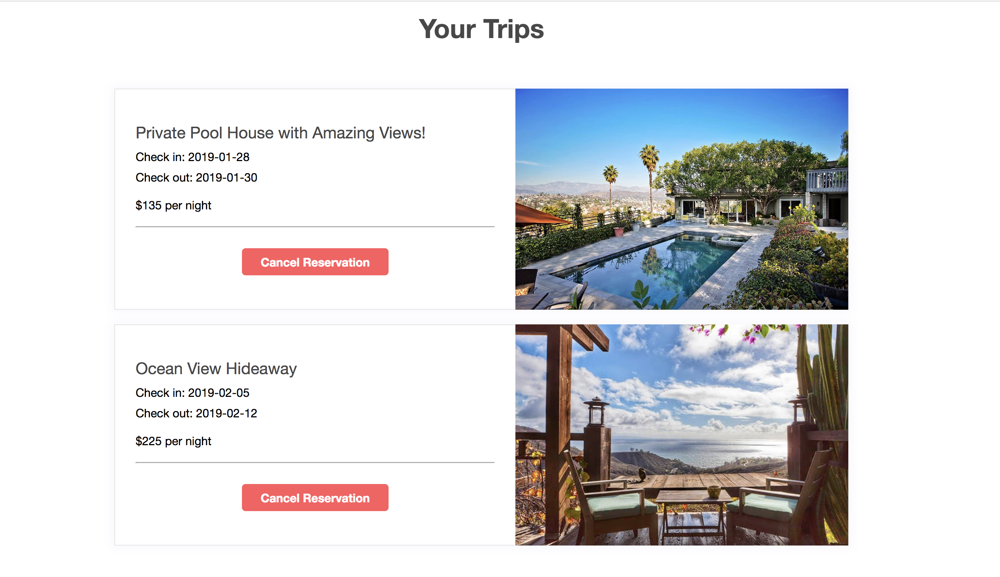

[Link to Live Site](https://vacationbnb.herokuapp.com/#/)

# VacationBnB

VacationBnb is a full-stack single-page web application inspired by AirBnB. The frontend utilizes React.js with Redux while the backend utilizes the Ruby on Rails framework with PostgreSQL.

## Technologies Used:
* React.js
* Redux
* Javascript
* Ruby on Rails
* PostgreSQL
* Google Maps API
* HTML5 & CSS3

## Splash Page
* Home page for the site.
* Users can signup, login, or search for listings by location.
<p align="center">

</p>

* Modal for login/signup is implemented through Redux and React, allowing modular re-use throughout the site.
```
  return ({
    action: (user) => dispatch(login(user)),
    otherForm: (
      <button onClick={() => dispatch(openModal('signup'))}>
        Signup
      </button>
    ),
    closeModal: () => dispatch(closeModal()),
    openModal: (formtype) => dispatch(openModal(formtype))
  })
```


## Homes Listing Page
* Displays homes in an organized layout with a responsive design for different screen sizes.
* Users can filter their selections by price and number of guests.


<p align="center">

</p>

* Users can also filter the available homes by moving the map to only focus on a specific location. This is accomplished by only querying the backend for homes within the bounds of the google maps window.
```
    homes = params[:bounds] ? Home.with_attached_photos.in_bounds(params[:bounds]) : Home.with_attached_photos.all
    if params[:price]
      homes = homes.where(price: price_range)
    end 
    if params[:num_guests]
      homes = homes.where(num_guests: guests_range)
    end
    if params[:query]
      homes = homes.where("city ILIKE ?", "%#{params[:query]}%") 
    end
```

## Individual Listing page
* This page shows all the information regarding a specific home selection.
* Users can view all photos and relevant information regarding the home.


<p align="center">

</p>


## Booking Calendar
* Users can select specific dates for the booking through the dropdown calendar:


<p align="center">

</p>

```
  <DateRangePicker
  startDate={this.state.start_date} 
  startDateId="start_date_id" 
  endDate={this.state.end_date} 
  endDateId="end_date_id" 
  onDatesChange={({ startDate, endDate }) => this.setState({ start_date: startDate, end_date: endDate })}
  focusedInput={this.state.focusedInput} 
  onFocusChange={focusedInput => this.setState({ focusedInput })} 
  startDatePlaceholderText="Check in"
  endDatePlaceholderText="Check out"
  numberOfMonths={1}
  />
```


## Trips Page
* This page shows both past trips and currently planned trips with the option to cancel a reservation.


##
